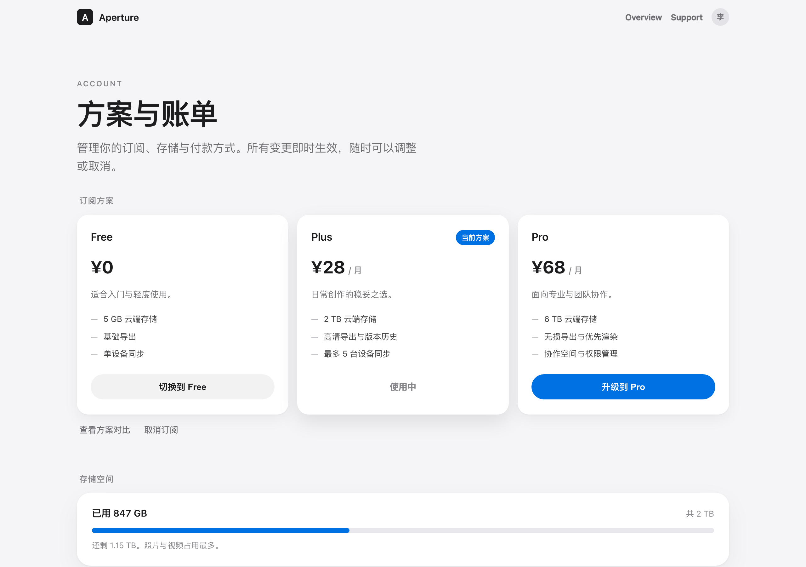
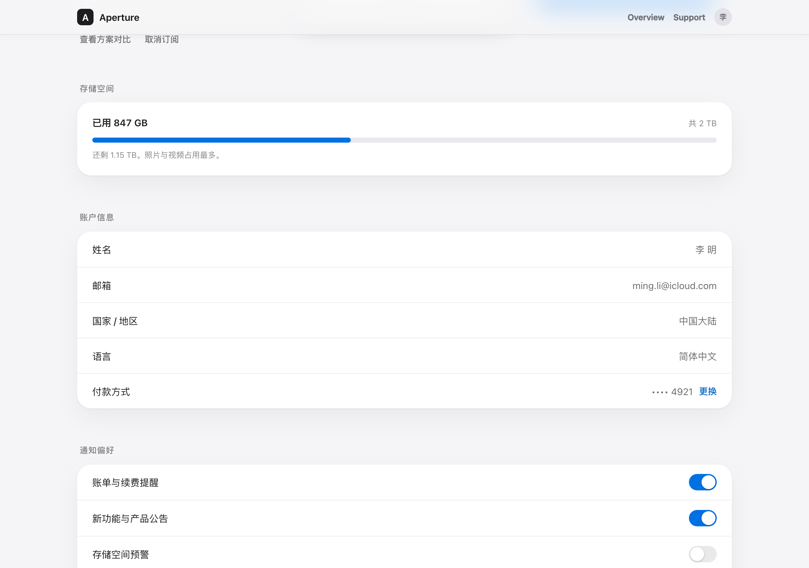
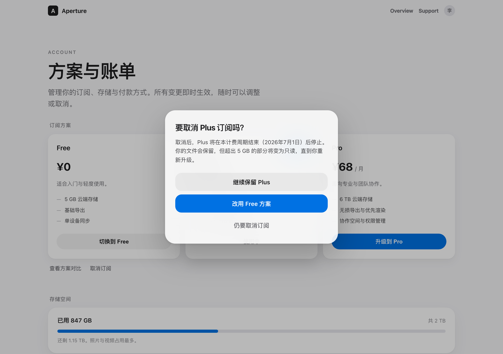
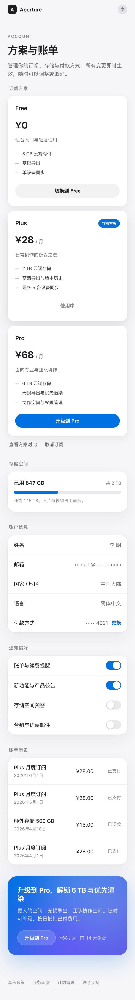
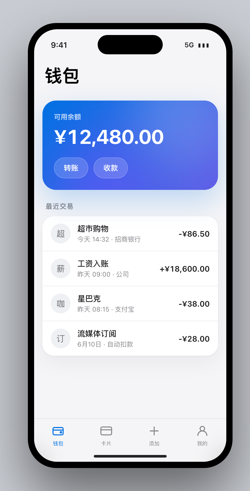
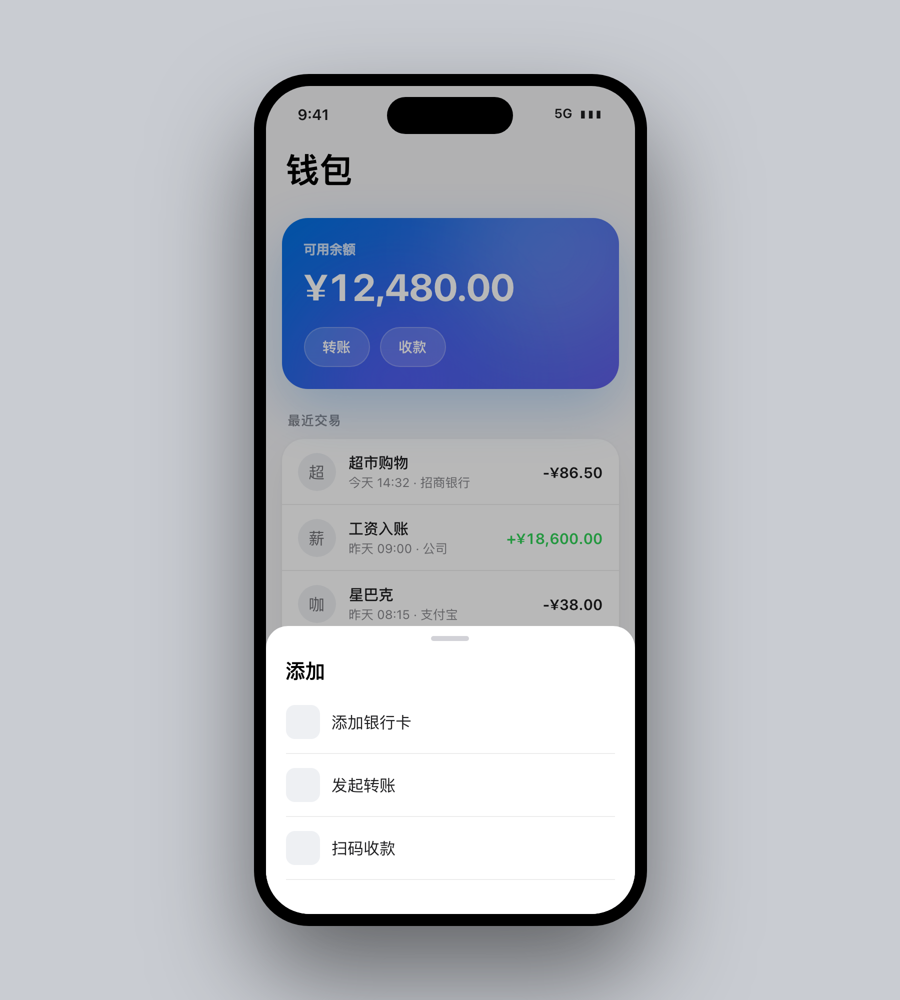

# Apple Liquid Glass — a design skill for AI coding agents

[English](./README.md) · [中文](./README.zh-CN.md)

> **Apple light grey-white ground + unified white surfaces + hairline dividers; glass only where layers truly overlap. Restraint is the luxury.**

A portable, markdown-based **skill** that teaches an AI coding agent (Claude Code, and any agent that reads skill files) to produce **Apple-grade web UI** — the calm, premium "macOS Liquid Glass" look of apple.com / Apple Newsroom / the latest macOS. Not a component library you import; a **design system + decision discipline** the agent reasons with, so the output feels like Apple *by the sum of small correct decisions* — not by one gimmick.

<p align="center">
  
</p>

---

## The problem it solves

Ask any model for a "clean, Apple-style page" and you usually get the **AI default**: fragmented cards each with its own border + tint + colored left-bar, `backdrop-filter` blur smeared on everything, rainbow gradients, a warm cream ground, Inter as the brand face. It reads as "generic AI page," not Apple.

This skill encodes *why* that's wrong and *what* Apple actually does, as executable rules:

- **Unified surface > fragmented cards.** Many sibling items go on **one** white panel with hairline dividers — fragmentation is enemy #1.
- **Glass is seasoning, not the dish.** Frost only where layers truly overlap (sticky nav, modal, colored CTA). Plain content = solid white + soft shadow.
- **Hierarchy from weight + size + grayscale, not color.** Body is black-white-grey; color is *accent only* (one blue).
- **Restraint is luxury.** A thousand "no"s for one "yes." Whitespace and hierarchy before any border/fill/icon.
- **Quality lives in details.** Negative tracking on titles, `tabular-nums`, hairlines, gentle hover lift, 180%-saturation glass, scroll-edge nav.

---

## Install

Clone into your agent's skills directory. For Claude Code:

```bash
git clone https://github.com/naplesblue/apple-design-skill.git \
  ~/.claude/skills/apple-liquid-glass
```

That's it. The agent auto-discovers the skill from `SKILL.md`'s frontmatter and loads it when the task matches (see triggers below). For other agents, point them at `SKILL.md` — everything is plain markdown + CSS, no build step, no dependency.

**Triggers:** "Apple style", "liquid glass", "make it look like apple.com", "clean / premium / minimal UI", "苹果风", "液态玻璃" — or any request to build a web page/component that should feel Apple-grade.

---

## How it works

Two modes:

- **Build** — new UI. The agent follows a fixed workflow: read `design-system.md` → drop in `tokens.css` → pick a page recipe from `patterns.md` → compose from `components.md` → (if there's an interactive layer) apply `motion.md` → check against `reference.html` → run the `checklist.md` gate.
- **Review** — audit existing CSS/pages for "is this Apple / make it consistent." `review.md` finds the real visual surface, scores against the system, and returns a prioritized, `file:line`-cited fix list mapped back to tokens.

The whole thing is **framework-agnostic**: the files assume plain HTML/CSS. In React/Vue/Svelte you translate the CSS to your styling system but keep the *exact token values*, the panel-not-cards pattern, and the glass-only-on-overlap rule.

---

## What's in the box

| File | Role |
|---|---|
| `SKILL.md` | Entry point — philosophy, workflow, anti-slop list, self-check. The agent reads this first. |
| `design-system.md` | Full spec: color, type scale, spacing/radius/shadow tiers, glass recipe, material depth grammar, responsive. |
| `tokens.css` | `:root` custom properties — drop into any project, reference via `var(--…)`. |
| `components.md` | Copy-paste HTML+CSS: glass nav, unified panel list, card grid, segmented control, tags, buttons, colored CTA, toggle, live dot. |
| `patterns.md` | Page-level recipes (reading 720 / grid 1080 containers · detail / index / home / form archetypes) + the decision trees. |
| `motion.md` | Fluid interaction layer for summoned/dismissed surfaces: springs, interruptibility, same-path enter/exit, materialize, reduced-motion. |
| `app.md` | **App / iOS shell layer** — device frame (exact iPhone spec), status bar, large-title-collapse nav, tab bar, edge-anchored bottom sheet, safe areas, mobile-first rules. Read it when the task is a phone screen. |
| `icons.md` | **Line-icon layer** — a curated [Lucide](https://lucide.dev)-based inline SVG set (one 24-grid stroke), grayscale `currentColor` with accent only on action/active, a size table, and restraint rules so icons earn their place (no grey squares, no emoji). |
| `checklist.md` | The standalone "done" gate. |
| `review.md` | Review-mode audit workflow. |
| `reference.html` | Rendered living style guide — open it in a browser; it's the ground-truth look. |

---

## Examples

The `examples/` folder ships a complete, real page built end-to-end with the skill — an **Account & Plan** page deliberately loaded with every trap the anti-slop list warns against, so you can see each Apple-correct resolution. Open `examples/account.html` in a browser (it's interactive: scroll for the glass nav edge, toggle switches, open the cancel sheet).

**Plan tiers + storage meter** — the fragmentation and color-as-decoration traps. Tiers stay all-white/grayscale with **one** accent on the current plan; the storage meter is a grayscale track with a single accent fill, `tabular-nums`, solid white (not glass).


**Unified panels** — account details and notification toggles each go on **one** white panel with hairline dividers, not a pile of cards. Glass nav shows its scroll-edge hairline only once content scrolls beneath.



**Interactive layer** — the "cancel subscription" sheet **materializes** (blur + scale + opacity together) over a dimmed scrim, and applies *forgiveness*: the prominent action is the gentle "switch to Free," while the destructive "cancel anyway" is a quiet text action — never a scary red confirm.



**Responsive** — one `clamp()`-based design; tiers collapse to a single column on mobile, touch targets ≥ 44px.



### App / iOS screens

For phone screens, `app.md` adds the mobile shell the web system doesn't ship: an **exact-spec iPhone device frame** (bezel, Dynamic Island, status bar, home indicator — never hand-rolled), a **large-title nav that collapses on scroll**, a **glass tab bar** (real line icons from `icons.md` — grayscale, one accent on the active tab), and an **edge-anchored bottom sheet**. The *content* still comes from the core system — so a wallet screen is just: colored-glass balance hero (the one color moment) + a **unified transaction list** with `tabular-nums` (amounts stay grayscale — no green-income "color-by-status" trap) + tab bar. See `examples/wallet.html`.

<p>
  
  
</p>

---

## Self-check gate

Before claiming "done," the output passes a checklist (excerpt):

- Ground `#f5f5f7` (cool), content on `#fff`, container centered.
- Sibling items → **one panel + hairline**, not fragmented cards.
- Glass **only** on nav / overlay / CTA; plain blocks solid white + soft shadow.
- Big titles negative-tracked; numbers `tabular-nums`; radius + shadow from named token tiers.
- Accent is one blue (heat-orange / brand only when meaningful); everything else grayscale.
- Visually matches `reference.html`.

---

## Credits & license

- **Motion layer** (`motion.md`) is adapted from [emilkowalski/skills](https://github.com/emilkowalski/skills) `apple-design` (MIT © Emil Kowalski), itself distilled from Apple's WWDC talks on fluid interfaces and typography.
- **Icon paths** (`icons.md`) are from [Lucide](https://lucide.dev) (ISC License © Lucide Contributors).
- Everything else © 2026 naplesblue.
- **[MIT License](./LICENSE)** — use, modify, ship freely; keep the notice.

Not affiliated with or endorsed by Apple Inc. "Apple," "macOS," and related marks belong to Apple Inc. This skill teaches a *visual language*; it ships no Apple assets.
